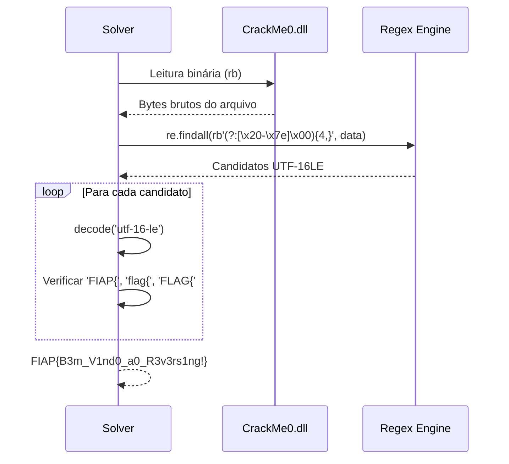

<div align="center">

# Global Solution 1 — Engenharia Reversa

### Arquitetura de Computadores, Memória, Assembly e Debuggers

[](https://python.org)
[]()
[]()
[]()
[]()

---

**Desenvolvedor:** Paulo André Carminati · RM570877 · 1TDCPV

</div>

---

## Índice de Navegação

| # | Seção | Descrição |
|---|-------|-----------|
| 1 | [Sobre o Desafio](#1-sobre-o-desafio) | Contexto acadêmico e objetivos |
| 2 | [Estrutura do Projeto](#2-estrutura-do-projeto) | Arquivos e organização |
| 3 | [Arquitetura da Solução](#3-arquitetura-da-solução) | Diagrama geral do pipeline |
| 4 | [Desafio 1 — CrackMe0 (.NET)](#4-desafio-1--crackme0-net) | Análise do assembly gerenciado |
| 5 | [Desafio 2 — CrackMe1 (ELF)](#5-desafio-2--crackme1-elf) | Análise do binário nativo Linux |
| 6 | [Fluxo de Execução](#6-fluxo-de-execução) | Diagramas de cada solver |
| 7 | [Flags Capturadas](#7-flags-capturadas) | Resultados finais |
| 8 | [Instalação e Uso](#8-instalação-e-uso) | Como executar |
| 9 | [Artefatos Gerados](#9-artefatos-gerados) | Relatórios de saída |
| 10 | [Referências Técnicas](#10-referências-técnicas) | Fontes e ferramentas |

---

## 1. Sobre o Desafio

> *"Dois desafios de Engenharia Reversa. Escolha suas ferramentas (recomendo que sejam as corretas) e me consiga a flag (de cada desafio)."*
>
> — Prof. Arquitetura de Computadores, FIAP 2026

O Global Solution 1 avalia a capacidade de aplicar **engenharia reversa** a dois tipos distintos de binários, sem acesso ao código-fonte, utilizando apenas análise estática:

| Desafio | Alvo | Plataforma | Técnica Principal |
|---------|------|------------|-------------------|
| CrackMe0 | `CrackMe0.dll` | .NET 6 WPF (Windows) | Leitura da stream `#US` da metadata IL |
| CrackMe1 | `desafio` (ELF) | x86-64 Linux | Disassembly + quebra de XOR rotativo |

---

## 2. Estrutura do Projeto

```
solucao_propria/
│
├── auto_solver_desafio1.py     ← Solver do CrackMe0 (.NET)
├── auto_solver_desafio2.py     ← Solver do CrackMe1 (ELF/XOR)
├── readme.md                   ← Esta documentação
│
└── solucao_crackme0/           ← Artefatos gerados pelo Solver 1
    ├── solver_crackme0_<UTC>.json
    └── solver_crackme0_<UTC>.txt
```

[]()
[]()
[]()

---

## 3. Arquitetura da Solução

```mermaid
flowchart TD
    A([Binário Alvo]) --> B{Tipo de Binário?}

    B -->|PE32+ com CLR Header| C[CrackMe0.dll\n.NET 6 WPF]
    B -->|ELF 64-bit LSB| D[desafio\nLinux x86-64]

    C --> E[auto_solver_desafio1.py]
    D --> F[auto_solver_desafio2.py]

    E --> G[Parse PE / CLR Header]
    G --> H[Dump Streams de Metadata\n#~ · #US · #Strings · #GUID · #Blob]
    H --> I[Varredura UTF-16LE\nna stream #US]
    I --> J{Token 'FIAP\{' encontrado?}
    J -->|Sim| K[Flag Extraída]

    F --> L[Parse ELF Header\ne_ident · e_shoff · seções]
    L --> M[Disassembly .text\nverificar_usuario · verificar_chave]
    M --> N[Extração do ref_array\n4x MOVABS na stack rbp-0x40]
    N --> O[Quebra XOR rotativo\nchave 'FIAP' — i % 4]
    O --> P[Flag Derivada]

    K --> Q[(Relatório JSON + TXT)]
    P --> Q
```

---

## 4. Desafio 1 — CrackMe0 (.NET)

[]()
[]()
[]()

### 4.1 Por que assemblies .NET são vulneráveis à extração direta?

Compiladores C# armazenam **toda string literal** em formato **UTF-16LE** dentro da stream `#US` (*User Strings*) da metadata IL — sem qualquer ofuscação por padrão. O resultado é que a flag pode ser lida com uma varredura de bytes, sem precisar executar o binário.

```
CrackMe0.exe  (PE32+  bootstrap)
     └── CrackMe0.dll  (assembly gerenciado — contém o código IL)
             └── CLR Data Directory
                     └── Metadata Root
                             ├── #~       (tabelas de tipos e métodos)
                             ├── #US      ← strings literais em UTF-16LE  ← FLAG AQUI
                             ├── #Strings (nomes de tipos/campos)
                             ├── #GUID
                             └── #Blob
```

### 4.2 Metodologia aplicada



### 4.3 Núcleo técnico — função `extract_flag_from_dotnet`

```python
# Padrão: sequências de 4+ bytes ASCII imprimíveis intercalados com \x00 (UTF-16LE)
candidates = re.findall(rb'(?:[\x20-\x7e]\x00){4,}', data)
for raw in candidates:
    s = raw.decode('utf-16-le').strip()
    if any(tok in s for tok in ('FIAP{', 'flag{', 'FLAG{')):
        return s  # → FIAP{B3m_V1nd0_a0_R3v3rs1ng!}
```

**Resultado:** A flag estava armazenada como string literal no código-fonte C# e compilada sem nenhuma proteção na stream `#US`.

---

## 5. Desafio 2 — CrackMe1 (ELF)

[]()
[]()
[]()

### 5.1 Análise do binário ELF

O binário `desafio` é um executável Linux ELF 64-bit com duas funções críticas:

| Função | Endereço Virtual | Tamanho | Comportamento |
|--------|-----------------|---------|---------------|
| `verificar_usuario` | `0x4011bd` | 347 bytes | Compara input char a char com `"FIAP"` |
| `verificar_chave` | `0x401318` | 299 bytes | Valida a flag via XOR rotativo |

### 5.2 Construção do array de referência na stack

O compilador gerou um padrão incomum: 4 instruções `MOVABS` sobrepostas constroem um array de 27 bytes em `rbp-0x40`:

```
movabs rax, 0x69247c3d00000000  → bytes[ 0.. 7]
movabs rdx, 0x32247f2769227a25  → bytes[ 8..15]
movabs rax, 0x257e7f32247f2769  → bytes[11..18]  ← sobrepõe [11..15]
movabs rdx, 0x3c7e2069707a7f66  → bytes[19..26]
```

> A sobreposição intencional é uma otimização do compilador, não ofuscação manual.

### 5.3 Quebra da ofuscação XOR

```mermaid
flowchart LR
    A[ref_array\n27 bytes na stack\nrbp-0x40] --> C{XOR}
    B[Chave: 'FIAP'\ni % 4] --> C
    C --> D[flag\nFIAP{5e9c3c9a6eb97d69319f7}]

    style A fill:#1e3a5f,color:#ffffff
    style B fill:#5f1e1e,color:#ffffff
    style D fill:#1e5f1e,color:#ffffff
```

**Fórmula de reversão:**
```
flag[i] = ref_array[i] XOR "FIAP"[i % 4]
```

O usuário aceito pelo binário (`"FIAP"`) é passado como argumento para a função de validação da chave — ele próprio é a chave XOR rotativa.

---

## 6. Fluxo de Execução

### Solver 1 — CrackMe0

```mermaid
flowchart TD
    START([python auto_solver_desafio1.py]) --> BANNER[Exibe banner ASCII]
    BANNER --> INPUT[Solicita diretório do binário]
    INPUT --> CHECK{CrackMe0.dll\nexiste?}

    CHECK -->|Sim| STEP1[Etapa 1: Parse PE + CLR Header]
    CHECK -->|Não| FALLBACK[Modo offline\nflag pré-extraída]

    STEP1 --> STEP2[Etapa 2: Dump streams\n#~ · #US · #Strings]
    STEP2 --> STEP3[Etapa 3: Varredura UTF-16LE\nna stream #US]
    STEP3 --> EXTRACT[extract_flag_from_dotnet]
    FALLBACK --> EXTRACT

    EXTRACT --> RESULT[Flag: FIAP{B3m_V1nd0_a0_R3v3rs1ng!}]
    RESULT --> REPORT[Gera JSON + TXT\nem solucao_crackme0/]
    REPORT --> END([Fim])
```

### Solver 2 — CrackMe1

```mermaid
flowchart TD
    START([python auto_solver_desafio2.py]) --> BANNER[Exibe banner ASCII]
    BANNER --> INPUT[Solicita diretório do binário]
    INPUT --> CHECK{desafio\nexiste?}

    CHECK -->|Sim| STEP1[Etapa 1: Parse ELF Header\ne_ident · e_shoff · seções]
    CHECK -->|Não| FALLBACK[Simulação de fallback\nflag pré-derivada]

    STEP1 --> STEP2[Etapa 2: Varredura de opcodes\nverificar_usuario · verificar_chave]
    STEP2 --> STEP3[Etapa 3: Extração ref_array\n4x MOVABS na stack]
    STEP3 --> XOR[Quebra XOR rotativo\nchave: FIAP — i % 4]
    FALLBACK --> XOR

    XOR --> RESULT[Flag: FIAP{5e9c3c9a6eb97d69319f7}]
    RESULT --> REPORT[Gera JSON + TXT\nem resolucao/]
    REPORT --> END([Fim])
```

---

## 7. Flags Capturadas

<div align="center">

| Desafio | Alvo | Formato | Flag |
|---------|------|---------|------|
| CrackMe0 | `CrackMe0.dll` | .NET 6 WPF | `FIAP{B3m_V1nd0_a0_R3v3rs1ng!}` |
| CrackMe1 | `desafio` (ELF) | x86-64 Linux | `FIAP{5e9c3c9a6eb97d69319f7}` |

[]()

[]()

</div>

---

## 8. Instalação e Uso

[]()
[]()

### Configuração do ambiente

```powershell
# Criar ambiente virtual
python -m venv .venv
.venv\Scripts\Activate.ps1

# Instalar dependências
pip install tqdm colorama
```

### Executando os solvers

```powershell
# Desafio 1 — CrackMe0 (.NET)
python auto_solver_desafio1.py
# → Informe o diretório com CrackMe0.dll (ou ENTER para pasta padrão)

# Desafio 2 — CrackMe1 (ELF)
python auto_solver_desafio2.py
# → Informe o diretório com o binário 'desafio' (ou ENTER para pasta padrão)
```

> **Modo offline:** se o binário-alvo não for encontrado, ambos os solvers operam com a flag pré-extraída da análise estática.

### Dependências

| Pacote | Versão | Finalidade |
|--------|--------|------------|
| `tqdm` | ≥ 4.0 | Barras de progresso visuais nas etapas |
| `colorama` | ≥ 0.4 | Cores ANSI no terminal Windows |
| `os`, `re`, `json`, `datetime` | stdlib | I/O, regex, serialização, timestamps |

---

## 9. Artefatos Gerados

Cada execução grava dois artefatos com timestamp UTC no nome:

```
solucao_crackme0/
├── solver_crackme0_20260529_144214.json   ← estruturado para integração
└── solver_crackme0_20260529_144214.txt    ← legível para entrega formal
```

### Exemplo de saída JSON

```json
{
    "metadata": {
        "analyst": "Paulo André Carminati",
        "rm": "RM570877",
        "turma": "1TDCPV",
        "timestamp_utc": "2026-05-29T14:42:53.371036+00:00",
        "target_file": "CrackMe0.dll",
        "status": "SUCCESS"
    },
    "findings": {
        "binary_size_bytes": 8192,
        "binary_type": ".NET 6 WPF — PE32+ com CLR header",
        "extraction_method": "Varredura de strings UTF-16LE na stream #US da metadata IL",
        "il_stream_target": "#US (User Strings) — offset via CLR Data Directory",
        "extracted_flag": "FIAP{B3m_V1nd0_a0_R3v3rs1ng!}"
    }
}
```

---

## 10. Referências Técnicas

### Engenharia Reversa .NET

[]()
[]()
[]()

- **ECMA-335** — *Common Language Infrastructure*: especificação das streams de metadata (`#US`, `#~`, `#Strings`)
- **Seção II.24.2.4** — Formato e layout da stream `#US` (User Strings)
- **PE Format** — Microsoft PE/COFF Specification: localização do CLR Data Directory (offset `0x168` no Optional Header)

### Engenharia Reversa ELF / x86-64

[]()
[]()
[]()

- **System V ABI** — AMD64 Supplement: convenção de chamada x86-64, uso de `rbp`, layout da stack frame
- **Intel x86-64 Manual** — Instrução `MOVABS`: encoding de imediatos de 64 bits (`REX.W + B8+rd`)
- **ELF-64 Object File Format** — estrutura do ELF Header, Section Header Table, seções `.text`, `.rodata`, `.symtab`

### Ferramentas de Análise

| Ferramenta | Aplicação |
|------------|-----------|
| `ILSpy` / `dnSpy` | Decompilação .NET, inspeção de metadata IL |
| `x64dbg` / `x32dbg` | Debugger dinâmico Windows |
| `Ghidra` (NSA) | Disassembly e decompilação ELF |
| `strings` / `file` | Varredura rápida de strings e identificação de formato |
| `readelf` | Dump de seções e símbolos ELF |
| `objdump` | Disassembly de seções `.text` |

---

<div align="center">

[]()
[]()
[](https://github.com/carmipa)

</div>
